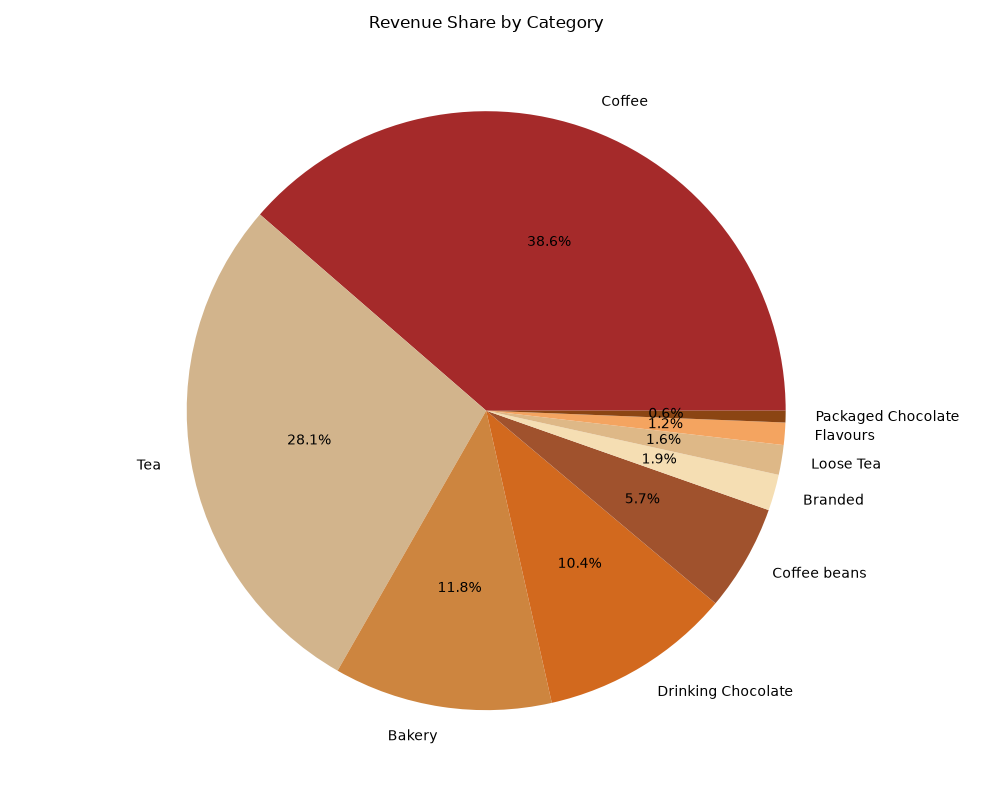
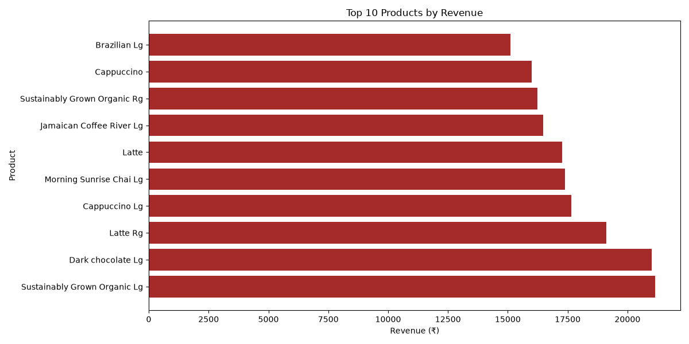
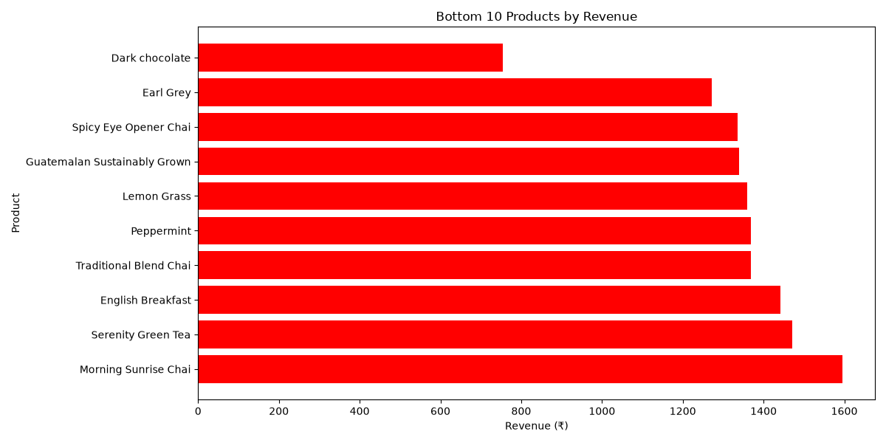

.png)
# ☕ CoffeeCafe-Revenue-Analysis

> **Turning 1,49,116 coffee transactions into actionable business insights**


---

## 📌 What is this project?

A complete end-to-end data analysis project that analyzes **1,49,116 real coffee shop transactions** to identify which products drive revenue, which are underperforming, and how the business can optimize its menu for higher profitability.

---

## 🎯 Business Problem

Afficionado Coffee Roasters had no clear visibility into:
- Which products are popular vs profitable
- Which products could be removed without revenue loss
- How dependent the business is on specific categories

---

## 📊 Key Results at a Glance

| Metric | Value |
|---|---|
| 💰 Total Revenue | ₹ 6,98,812 |
| 🧾 Total Transactions | 1,49,116 |
| 🛍️ Unique Products | 80 |
| 🏆 Top Category | Coffee (38.6%) |
| ⭐ Hero Products | 42 out of 80 drive 80% revenue |
| 📈 Highest Revenue Product | Sustainably Grown Organic Lg (₹21,151) |
| 📉 Lowest Revenue Product | Dark Chocolate regular (₹755) |

---

## 📈 Revenue by Category



---

## 🏆 Top 10 Products by Revenue



---

## 📉 Bottom 10 Products by Revenue



---

## 💡 Key Insights

> 💬 **Insight 1:** Coffee + Tea together = **66.7% of revenue** — the business is heavily dependent on these two categories

> 💬 **Insight 2:** **Popularity ≠ Profitability** — Earl Grey Rg is the most sold product but doesn't appear in top revenue products

> 💬 **Insight 3:** **38 products contribute only 20% of revenue** — strong menu simplification opportunity

> 💬 **Insight 4:** **Large size variants always outperform** small and regular sizes across all product lines

---

## 🛠️ Tools Used

| Tool | Purpose |
|---|---|
| 🐍 Python | Core programming language |
| 🐼 Pandas | Data loading and manipulation |
| 📊 Matplotlib | Charts and visualizations |
| 🌐 Streamlit | Interactive web dashboard |
| 🐙 GitHub | Version control |

---

## 📁 Project Files

| File | Description |
|---|---|
| `analysis.py` | Data loading, cleaning, revenue analysis, Pareto |
| `charts.py` | Static chart generation |
| `dashboard.py` | Interactive Streamlit web dashboard |
| `research_paper.docx` | Detailed EDA report |
| `executive_summary.docx` | 1-page summary for stakeholders |

---

## 🚀 How to Run

**Install dependencies:**
```bash
pip install pandas matplotlib streamlit
```

**Run the dashboard:**
```bash
python -m streamlit run dashboard.py
```

---

## 📈 Dashboard Features
- ✅ KPI cards — Revenue, Transactions, Products
- ✅ Category and Store Location filters
- ✅ Top-N product slider (5 to 20)
- ✅ Revenue by category bar chart
- ✅ Top N products chart
- ✅ Revenue share pie chart
- ✅ Bottom 10 products chart
- ✅ Product performance drill-down table
- ✅ Popularity vs Revenue scatter plot

---

## 👩‍💻 Author
**Shruti Mahawar**
[](https://github.com/ShrutiMahawar06)

---

⭐ **If you found this project useful, please star the repository!**
